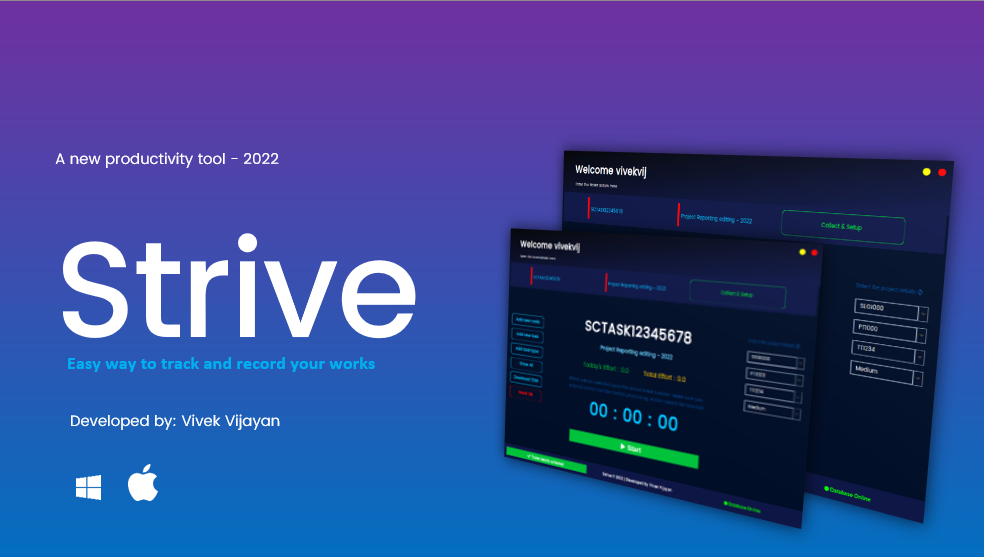

## Getting Started with Strive

Welcome to the new work effort tracking and work management tool. 

## How to use
 - For Windows
    - download the `strive.exe` - [Download](https://github.com/vivek-vijayan/strive/raw/Production/Strive.exe)
    - Once downloaded, click on `StartApplication.vbs`

- For Mac & Linux
    - Download the `strive.jar` - [Download JAR](https://github.com/vivek-vijayan/strive/raw/Production/strive.jar)
    - Run the jar file as `java -jar strive.jar` 

## Folder Structure - Development purpose

The workspace contains two folders by default, where:

- `src`: the folder to maintain sources
- `lib`: the folder to maintain dependencies

Meanwhile, the compiled output files will be generated in the `bin` folder by default.

> If you want to customize the folder structure, open `.vscode/settings.json` and update the related settings there.

## Dependency Management

The `JAVA PROJECTS` view allows you to manage your dependencies. More details can be found [here](https://github.com/microsoft/vscode-java-dependency#manage-dependencies).
